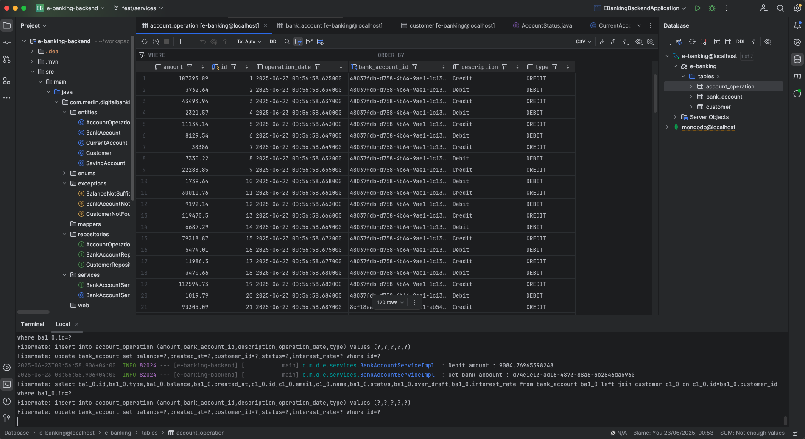
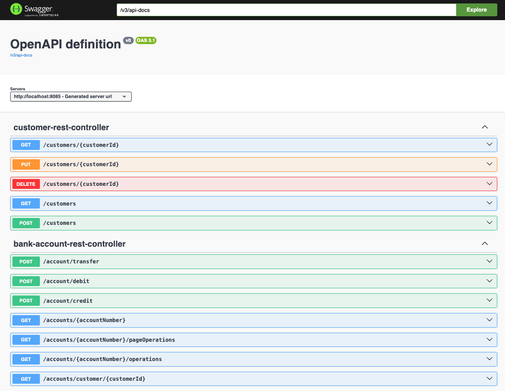
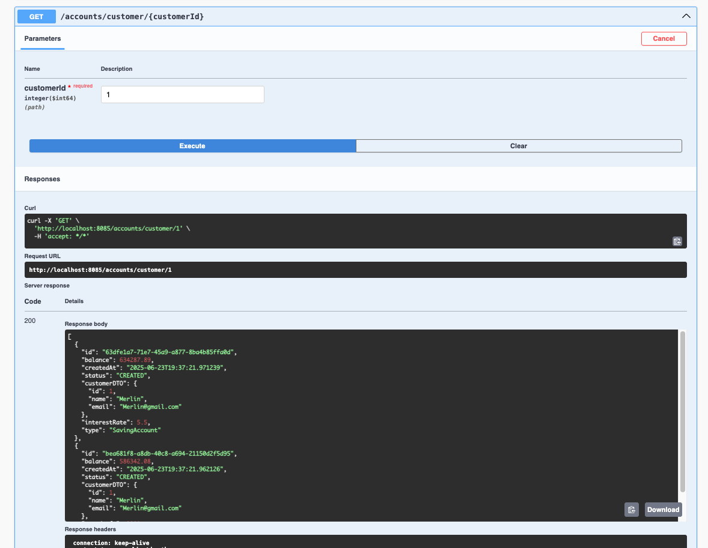
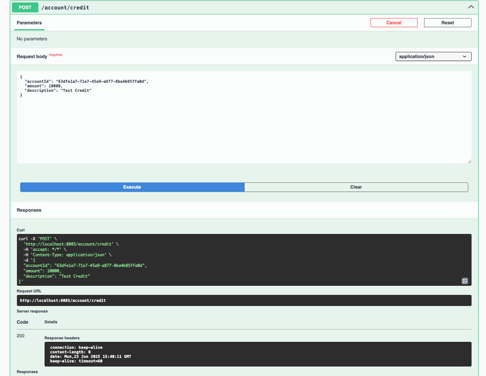
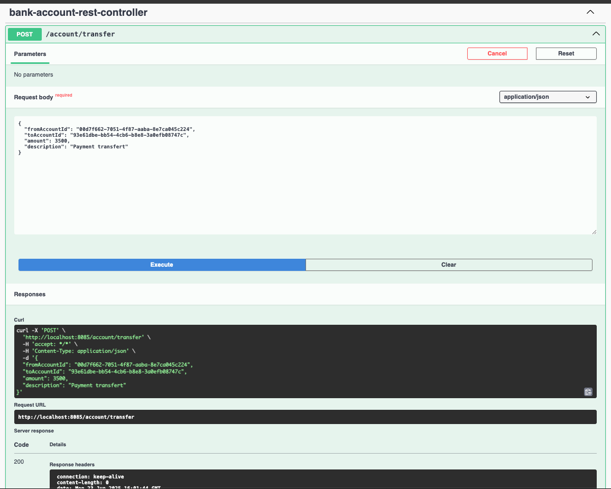
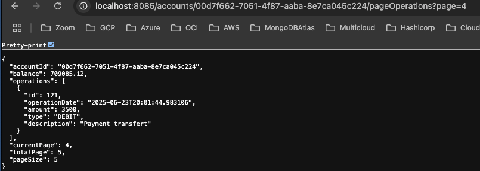
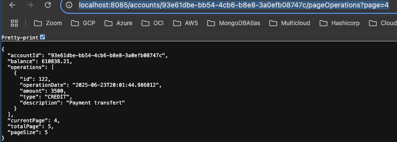

# e-banking-backend

# Frontend https://github.com/devsahamerlin/e-banking-frontend

### Inheritance Mapping Strategies:
- Single Table: Allow to have only 1 table in Database (`bank-account` table with `type` called `Discrimator column`)
- Table Per Class: Allow to have 2 tables (`current-account` table + `over-draft` property and `saving-account` table + `interest-rate` property)
- Joined Table: Allow to have 3 tables (`account` table with common properties, `current-account` table with `over-draft` property and `saving-account` with `interest-rate` property )

### Tech Stack:
- Java Spring Boot
- Angular
- Spring Security

### Database


### Swagger: http://localhost:8085/swagger-ui/index.html
```shell
mvn spring-boot:run
```


#### Get customer Banking Accounts



#### Credit Account


#### Transfer


#### Liste account transfert operations
- transfert Debit


- transfert Credit

