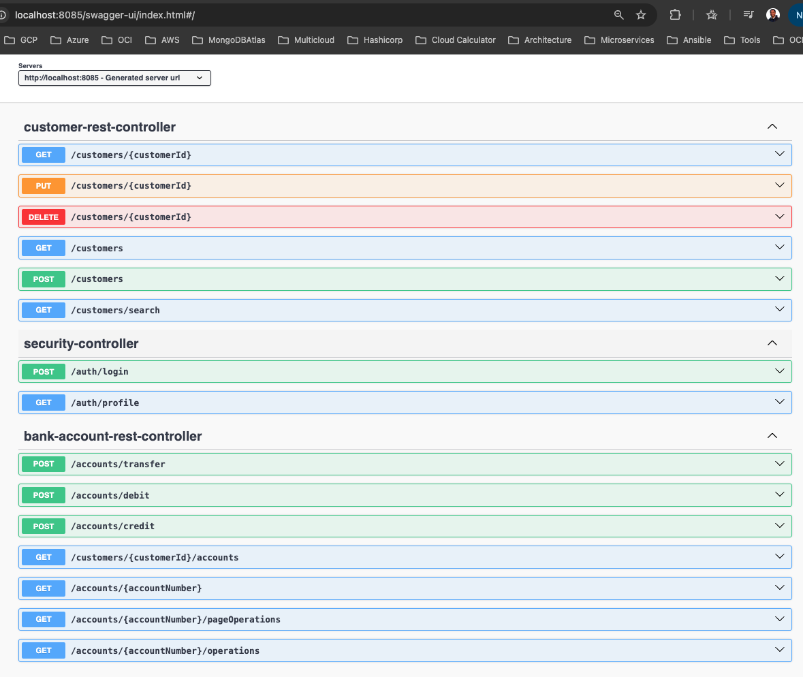

# e-banking-backend

# Frontend https://github.com/devsahamerlin/e-banking-frontend

L'application de gestion de comptes bancaires est une solution complète développée avec Spring Boot qui permet la gestion intégrale des clients, comptes bancaires et opérations financières. Le système intègre une architecture REST avec authentification JWT.


### Inheritance Mapping Strategies:
- Single Table: Allow to have only 1 table in Database (`bank-account` table with `type` called `Discrimator column`)
- Table Per Class: Allow to have 2 tables (`current-account` table + `over-draft` property and `saving-account` table + `interest-rate` property)
- Joined Table: Allow to have 3 tables (`account` table with common properties, `current-account` table with `over-draft` property and `saving-account` with `interest-rate` property )

### Tech Stack:
- Java Spring Boot
- Angular
- Spring Security

### Start redis server first before running the application
```shell
docker-compose -f common.yml -f redis.yml up -d
```


### Contrôleurs principaux

L'API est structurée autour de cinq contrôleurs principaux qui gèrent les différents aspects métier de l'application.

#### Contrôleur de tableau de bord (dashboard-controller)

Le contrôleur de tableau de bord offre une interface pour la supervision et la prise de décision.

##### Endpoints de vue d'ensemble et statistiques

- **GET /dashboard/overview** : Fournit une synthèse globale de l'état du système bancaire avec métriques essentielles
- **GET /dashboard/monthly-stats** : Génère des statistiques mensuelles configurables sur une période définie (défaut 12 mois)
- **GET /dashboard/account-types** : Analyse la répartition des types de comptes avec visualisation graphique
- **GET /dashboard/top-customers** : Identifie les clients les plus actifs avec classement paramétrable

##### Endpoints d'administration avancée

- **GET /dashboard/alerts** : Système d'alertes centralisé pour la surveillance opérationnelle
- **GET /dashboard/risk-analysis** : Module d'analyse des risques financiers et opérationnels
- **GET /dashboard/performance** : Métriques de performance système et applicative
- **GET /dashboard/complete** : Dashboard administrateur complet avec toutes les données consolidées


#### Contrôleur d'administration des comptes bancaires (bank-account-admin-controller)

Ce contrôleur centralise les fonctions administratives des comptes bancaires avec les endpoints suivants :

- **GET /admin/accounts** : Récupération de la liste complète des comptes
- **POST /admin/accounts** : Création de nouveaux comptes bancaires (courants ou épargne)
- **POST /admin/accounts/{accountId}/status/{accountStatus}** : Modification du statut d'un compte (CREATED, ACTIVATED, SUSPENDED, BLOCKED, CLOSED)
- **GET /admin/users/{userId}/operations** : Consultation des opérations effectuées par un utilisateur spécifique
- **GET /admin/accounts/search** : Recherche de comptes


#### Contrôleur REST des comptes bancaires (bank-account-rest-controller)

Ce contrôleur expose les fonctionnalités opérationnelles des comptes :

- **POST /accounts/transfer** : Exécution des virements entre comptes avec validation des soldes
- **POST /accounts/debit** : Traitement des opérations de débit avec contrôle de découvert
- **POST /accounts/credit** : Traitement des opérations de crédit
- **GET /customers/{customerId}/accounts** : Liste des comptes d'un client spécifique
- **GET /accounts/{accountNumber}** : Détails d'un compte par son numéro
- **GET /accounts/{accountNumber}/pageOperations** : Historique paginé des opérations
- **GET /accounts/{accountNumber}/operations** : Liste complète des opérations d'un compte


#### Contrôleur de gestion des utilisateurs (user-rest-controller)

La gestion complète du cycle de vie des utilisateurs est assurée par ce contrôleur :

- **GET /users/{userId}** : Consultation du profil utilisateur
- **PUT /users/{userId}** : Modification des informations utilisateur
- **DELETE /users/{userId}** : Suppression d'un compte utilisateur
- **GET /users** : Liste de tous les utilisateurs avec pagination
- **POST /users** : Création de nouveaux utilisateurs
- **POST /users/{userId}/deactivate** : Désactivation d'un compte utilisateur
- **POST /users/{userId}/change-password** : Modification du mot de passe
- **POST /users/{userId}/activate** : Réactivation d'un compte utilisateur
- **GET /users/search** : Recherche d'utilisateurs par critères
- **GET /users/current** : Informations de l'utilisateur connecté


#### Contrôleur de gestion des clients (customer-rest-controller)

Ce contrôleur gère les données clients de l'application :

- **GET /customers/{customerId}** : Consultation des détails d'un client
- **PUT /customers/{customerId}** : Modification des informations client
- **DELETE /customers/{customerId}** : Suppression d'un client
- **GET /customers** : Liste de tous les clients
- **POST /customers** : Création d'un nouveau client
- **GET /customers/search** : Recherche de clients


#### Contrôleur de sécurité (security-rest-controller)

La sécurité de l'application est gérée par ce contrôleur spécialisé :

- **POST /auth/register** : Inscription de nouveaux utilisateurs
- **POST /auth/refresh** : Renouvellement des tokens JWT expirés
- **POST /auth/login** : Authentification et génération de tokens JWT
- **GET /auth/profile** : Consultation du profil de l'utilisateur authentifié


### Test API avec Postman


### Database


### Swagger: http://localhost:8085/swagger-ui/index.html
```shell
mvn spring-boot:run
```


#### Get customer Banking Accounts


#### Credit Account


#### Transfer


#### Liste account transfert operations
- transfert Debit


- transfert Credit


### Account Management
- Operations are not allowed when the account status is `SUSPENDED`, `CLOSED`, or `BLOCKED`
